# ☀️ **Sunrise Chat** ☀️

📄 **Descripción**  
Proyecto de una aplicación de mensajería en tiempo real desarrollada con la metodología agil de Scrum. El objetivo del proyecto es realizar un proyecto sencillo pero escalable aplicando la metodologia de Scrum 📚.

🛠️ **Tecnologías Usadas**
- NodeJS
- React
- Socketio
- MongoDB
- Express
- Bcrypt
- Validator
- cors
- React-router-dom
- React-bootstrap
- Moment
- react-input-emoji
- JWT
- dotenv

✨ **Características**
- Registro y Logeo de usuarios
- Mensajes en tiempo real
- Implementacion de emojis
- Busqueda de usuarios
- Sistema de notificaciones
- Perzonalizacion de la marca de la app junto a su frontend

📸  **Capturas**
- Register

  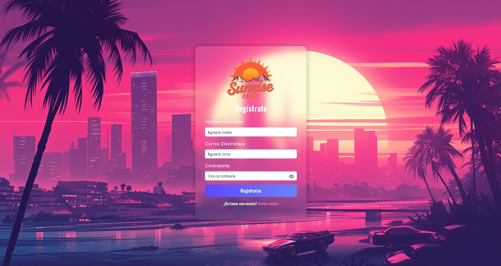
  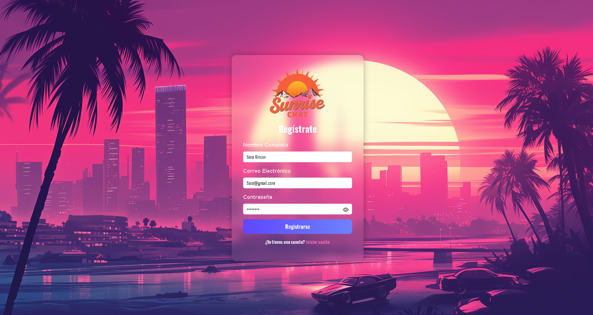
 

- Login

  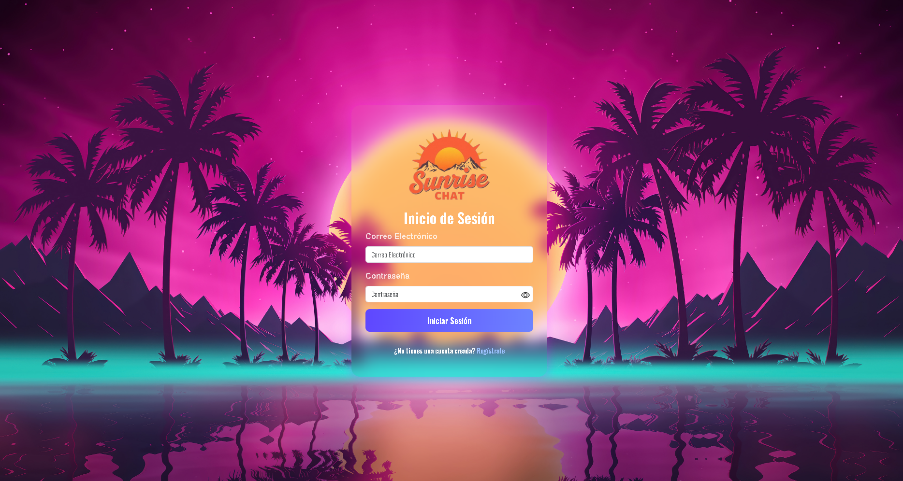
  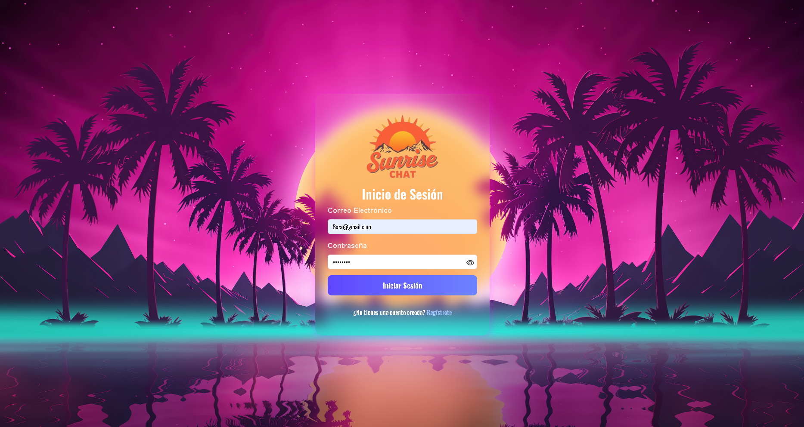
 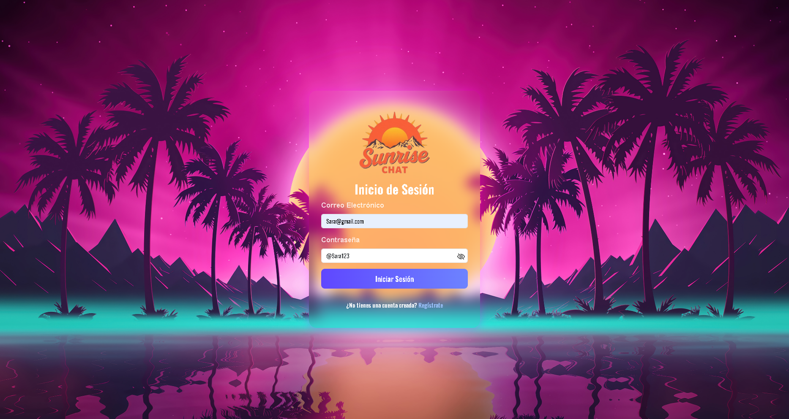

- Guardado
 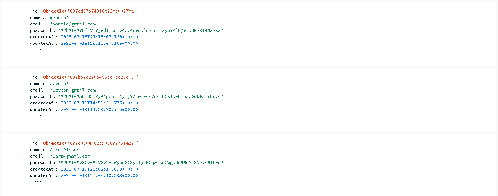

- ChatApp
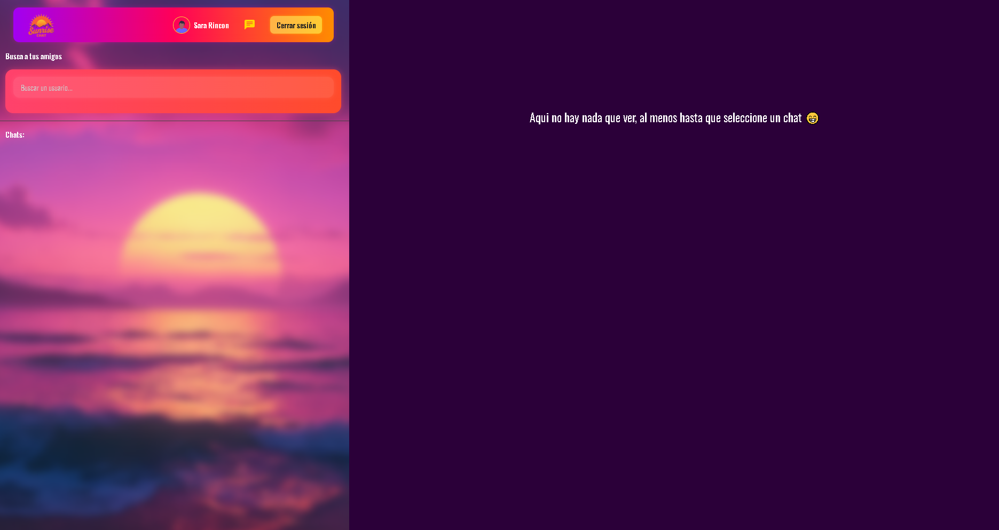

- Inicializacion de chats

  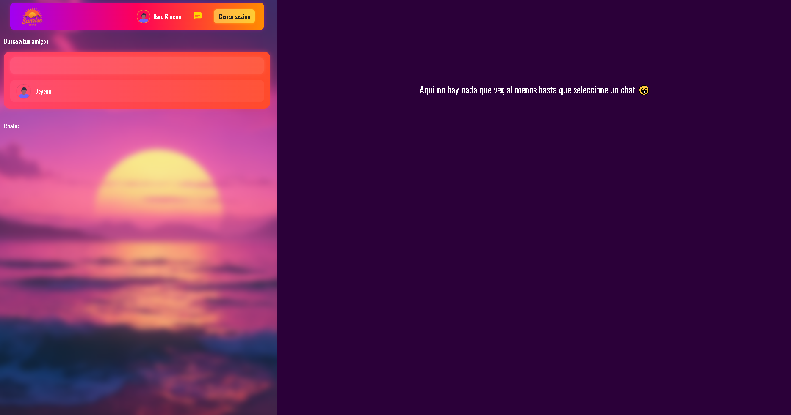
  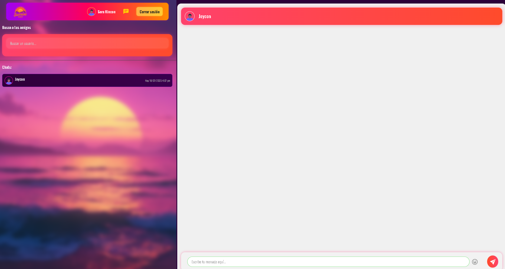
 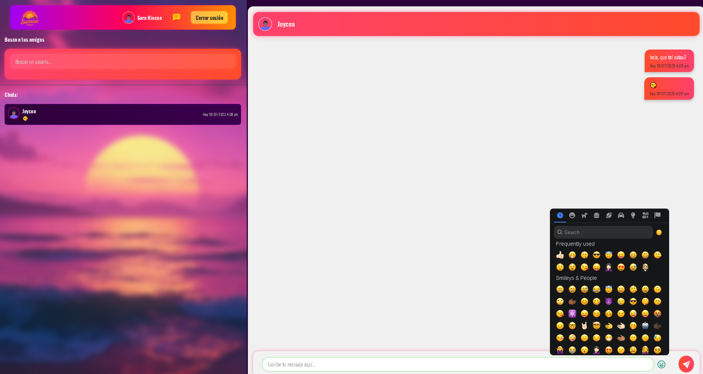

- Notificaciones

  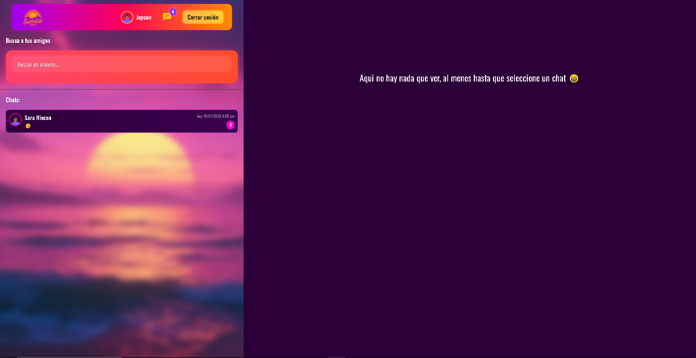
  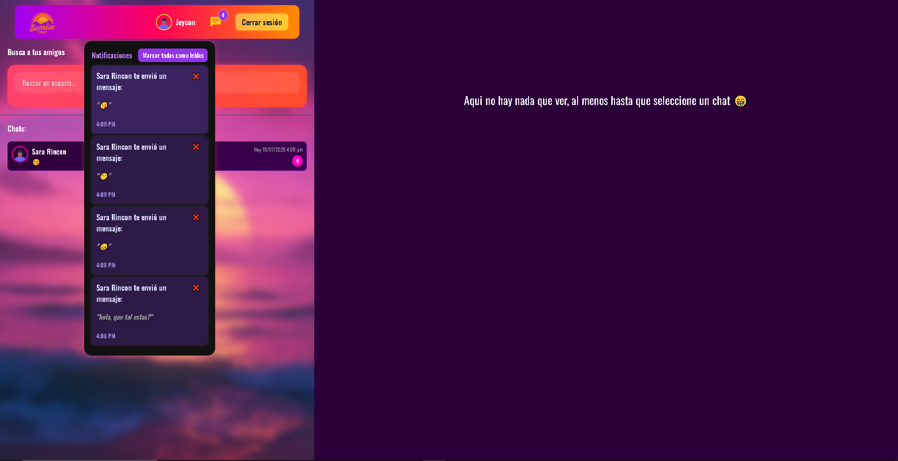

- Chat receptor
 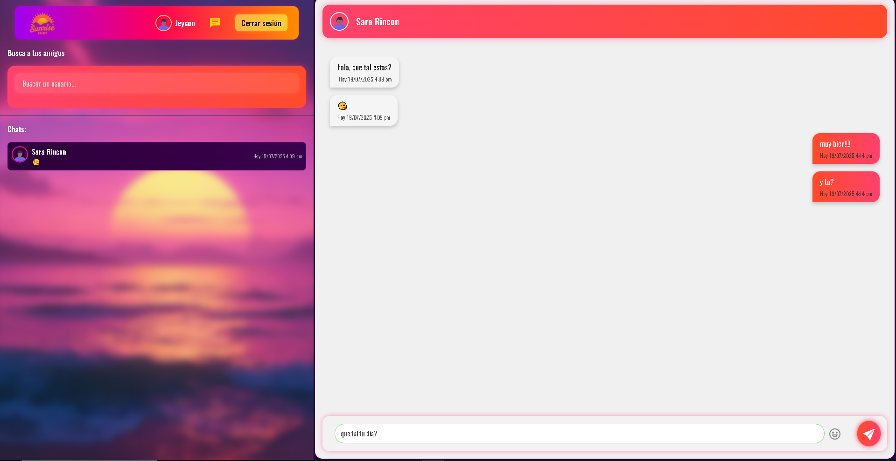

**🎥 Trailer**

🚀 **Modo de Uso**
1. git clone git@github.com:JeisonAlexis/Sunrise-Chat-.git
2. cd Sunrise-Chat-
3. Edita el .env alojado en /server con tus datos
4. cd server
5. npm install
6. npm run dev
7. cd ../client
8. npm install
9. npm run dev
10. Accede al servidor local http://localhost:5173

**Autor**
- Jeison Alexis Rodriguez Angarita 🙍‍♂️
- Arquitecturas Empresariales / Ingenieria de Sistemas / Universidad de Pamplona 👨‍🎓
- 2024 📅 
